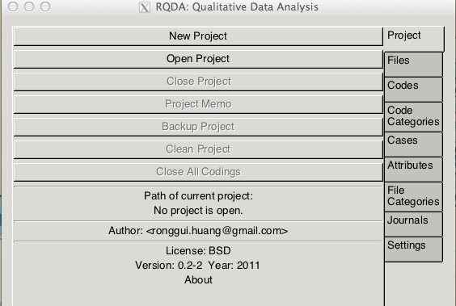
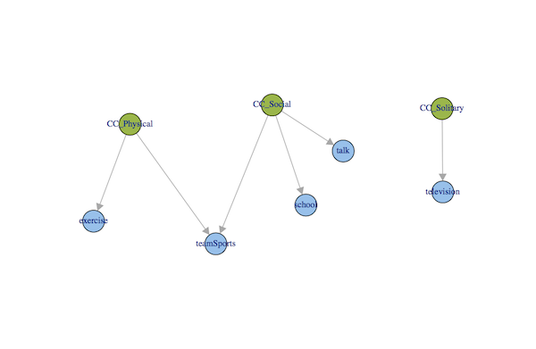
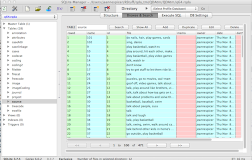

Qualitative Data Analysis with RQDA
====================================
Introduction
------------
This workshop covers the mechanics, rather than the methods, for performing a qualitative data analysis.  The examples will use the RQDA package running under RStudio.

Obtaining RQDA
--------------
RQDA is available on both PRI windows application servers: Kiev and Moscow. It is also available on the PRI linux network. Note that you must ssh into finland to run it as it does NOT run through the webserver version. 

If you want to load the software on your own machine, you will will not only be installing the RQDA package, but also GTK and RSQLite.   Information on the procedure can be found on the RQDA website [http://rqda.r-forge.r-project.org/](http://rqda.r-forge.r-project.org/).

Additionally, you will want to install the FireFox add-on: SQLite Manager.

Starting RQDA
---------------
Once your packages are loaded you will want to create a folder to store your text files.   (In RStudio, you can create an 'RStudio Project' in this folder.)  In addition to the text files, you can store any R programs and you will create an 'RDQA Project' coding database there too.

Now load the RQDA package by checking it in the Packages list in RStudio.  The first time you load the library, RQDA should start on its own, but if you close it during the session you can restart it again from the command line:

```{r eval=FALSE}
RQDA()
```
The RQDA panel opens a separate window, but keep your normal RStudio console open as you will need both windows.




n.b. GTK display will likely throw errors. In most cases you can simply ignore the errors. On Windows, your theme could obfuscate the buttons.  If so, change the theme.

General Features of the Software
--------------------------------
#### Right-tabs/Panels
There are 9 basic Panels.  Some commands appear in all panels, but there are panel-specific commands as well.
#### Top-tabs
Each panel has a set of tabs at the top for the most common actions relevant to that panel.
#### Right-mouse Menus
Each panel also has a set of actions that you can access with a right-mouse click in the panel area.   Some of the actions are exactly the same as the top-tabs, but there are additional actions that are very important here, so be sure to examine them.
#### Memos
You can include some project-level comments/documentation by clicking on the "Project Memo" button.  Memos can be attached to items in the specific panels as well pertaining to specific codes, files, cases.   

Projects Panel
--------------

For a new project, click on the "New Project" button and supply a name and associate the name to the folder on your system that you created above. This will create a file on your system with the extension '.rqda'.   Once the project has been created you can click the "Open Project" button.

#### Backups
You can backup your entire database easily.  Choose a standard naming convention so that the backups are easy to identify on your file system.  


Files Panel
-----------
Files are the interviews for each subject in your study.  As of RQDA version 2.1 only plain text files are supported. Word documents or RTF files will need to be converted.  

If you change the original text files on your filesystem in any way, you will need to re-copy the modified files into the RQDA database again.    

You have several options for inserting your text data into RQDA...

#### Import existing plain text files
The content of your text files will be copied into a database when you import them into RQDA. To import a file into your project, click the "Files" button and then the "Import" button, then select the text file.

#### Bulk load 
If you want to import many files at once, you can use the `write.Files` command.  This is usually not an issue when you are coding individual transcripts, but it is a very useful feature when you want to extract open-ended questions from of a larger survey questionnaire for coding.  For example, I have a large survey of multiple choice questions, but question 64 is an open-ended question "What do you do with your friends when you are not in school?"  I can pull those responses into RQDA for coding.  

To begin, export the subject ID and open-ended question variables into a csv file from your SAS,Stata, SPSS, etc dataset and load the csv into an R data frame.  

If RQDA is not already running, you can start it and open your project using the R commands:

```{r eval=FALSE}
# Alternate way to load RQDA and open a project from the command console in R
library(RQDA)
RDQA ()
openProject("~/Documents/RStuff/QDAtm/QDAtm/QDAtm/q64.rqda", updateGUI=TRUE)
```

Once your project is open, take your csv file and load it into RQDA

```{r eval=FALSE}
# load csv containing case ID and open-ended question into an R data frame named q64

q64<-read.csv(file="q64.csv")

# Pull the text of the question contained in the column "ik_64_open" from the q64 data frame

q<-as.list(as.character(q64$ik_64_open))

# Assign the subject ID as the name of each File

names(q)<-q64$kidID
```
Here are the first 3 lines, you can see that you are creating a list of open-ended responses and each row is named with the subject ID.
```
q[1:3]

$`9`
[1] "play basketball, watch tv"

$`10`
[1] "play around, hit each other, make each other laugh"

$`11`
[1] "play basketball, play video games"
```
```{r eval=FALSE}
# Use the write.FileList command to copy this info into the RQDA database

write.FileList(q)

# Close the Project from the command line

closeProject()
```

#### Use RQDA to enter your data
The last way to create Files is to enter your text data directly into RQDA.  Click on the "Files" button and then the "New" button.  Enter a name for your Case and a text editor window will open for you to enter data.  Your data will not appear as separate files and you will need to open RQDA to edit the data.  However, we will see later that you can easily export the text from the RQDA database.  Using this method you will not need to worry about file conversion.  Note that to edit an existing file, right-click in the file listing area of the Files panel to locate "Edit File" menu option. 

Codes Panel
-----------
#### Adding codes
Click the Codes panel button and use the Add button to enter your codes. Press "OK" You can add a Memo for each code to describe its usage.

#### Marking your text with codes
* Click "Files" button and double-click to select your file
* Return to the "Codes" panel and highlight the text in your File and select the Code name and then click the "Mark" button.
* If you make a mistake, highlight the text and then click the "Unmark" button.

#### Basic retrieval of marked files
* You can double-click on any code name (or click the Coding button) to see all text segments that have used that code.

File Categories Panel
---------------------
You may have different file categories, for example an interview may be conducted as a face-to-face or telephone interview.  You can associate a "File Category" to each file in order to pull files of a specific category. 

Cases Panel
-----------
If you have multiple interviews for one person in separate files, you can create a "Case" id to associate the files with a particular "Case" or unit of analysis.   

Code Categories Panel
---------------------
Codes can be aggregated into Code Categories at any time during your coding.   A code can be in more than one category.   

Attributes Panel
----------------
You can add attributes like gender, age group, school, etc to a File or a Case.  These are a bit different than codes or categories in that they are a variable attached to the case with a single value.   Advantages to using them are that you cannot possibly put someone in multiple categories that should be mutally exclusive.  Disadvantages are that attributes are not as easy to use through the GUI.   When you are adding attributes ask yourself whether you really need this information in order to do the *coding* rather than the analysis.   If you don't need it to code, you can always store the information in a standard data frame and merge it with your coded file later.  

Settings Panel
--------------
You can click on the "Settings" button to set some defaults for your project.  This is especially useful if several people are working on the same project because you can identify the person coding.  Other settings will be useful in the next section on Retrieving Data.


Retrieving Data with the RQDA GUI
---------------------------------
You can view the results of your coding in a variety of ways. Retrieval is done in the Codes panel. However, overall options for retrieving are determined in the Settings panel.   This genenal 'Type of retrieval' setting determines whether or not the selected values in the Cases and File Categories panels act as filters when you retrieve your codings.

* unconditional -- Clicking on a code will bring up all files marked with the selected code
* case -- Clicking on a code will bring up only those files that are associated with the selected *case(s)* marked with the selected code
* filecategory -- Clicking on a code will bring up only those files that are associated with the selected *file category(s)* marked with the selected code
* both -- Clicking on a code will bring up only those files that are associated with the selected *case(s)* and selected *file categories* marked with the selected code.

Coding Tips
-----------
* You can create a code name for each 'question' in your interview. This makes it easy to pull responses to a particular question from all cases.   
* You can Merge codes
* You can Rename codes
* You many find it useful to use a standard prefix for Code Category names to make them easier to distinguish from the Codes in your reports and plots, e.g. "CC_health", "CC_education".
* You can have 2 different sets of codes. Go to the Settings panel to switch to a second code set and return to the Codes panel to add them. 

Output
------
#### Reports
From the GUI: In the Codes panel you can right-mouse on anywhere in the panel and select "Export Codings as HTML"  You will be asked to enter a filename and you can select one or more codes to be displayed.  A nicely formatted report will be created that you can open in your web browser.

[View report](http://help.pop.psu.edu/help-by-software-package/r-project/stat/rqda/figure/talkCodings.htm)

You can also select a file in the Files panel to export as html with the codings
[View report](http://help.pop.psu.edu/help-by-software-package/r-project/stat/rqda/figure/subject204.html)

From the command line: You can request information from the command line in RStudio when the project is Open. 
```{r eval=FALSE}
summaryCodings()
```
This will produce summary counts of the number of times codes were used, number of files using each code and the length of the coded text segments. You can store these summary statistics in an R data frame for subsequent analysis.

```
----------------
Number of codings for each code.

    school       talk teamSports 
         3          4          1 
----------------
Average number of words assciated with each code.

    school       talk teamSports 
  22.66667   80.25000   10.00000 
----------------
Number of files associated with each code.

    school       talk teamSports 
         3          4          1 
```         

#### Plots
You can create plots to describe your codings from the Code Categories panel.  Select one or more Code Categories and right-mouse to select "Plot Selected Code Categories".  A new window will open with a sociogram of your codings. This is an active diagram and there are many manipulations you can make to it.   You can export the final diagram to postscript.



Looking at the Database
-----------------------
You may never actually need to look at the Database that stores you coding, but it is very easy to do and it will help you understand how to use the software.  Download the SQLite Manager Firefox extension and take a look at your data.




The most common reasons to look at the database include:

#### Searching for text and complex queries
SQLite Manager includes a point-and-click Search window that will allow you to locate files easily.  For example you may want to find all files that contain a specific word or combination of words.

#### Extracting Data for Export
You can export your coding to csv or text files using SQLite Manager. But you can also write queries from the R console in RStudio.  For the latter, just wrap your SQL query in the `RDQAQuery()` function.  This allows you to bring your data directly into an R data frame where you can analyze and merge your data with related files.  Here is an example: 

```{r eval=FALSE}
# You will need to open project first and get codes and file names

myCodes<-RQDAQuery("select source.name as filename, source.id as fid, C.cid as cid, C.code as code
  from source  inner join 
         (select freecode.name as code, coding.cid, coding.fid from coding inner join freecode 
           where freecode.id = coding.cid and coding.status = 1) C
  where source.id = C.fid and source.status = 1")

# Then need to reshape into file id (or subject) level.  Great for merging in subject attributes and related quantitative information.

myPersonLevelFile<-reshape (myCodes, v.names="code", timevar="cid", idvar="fid", direction="wide") 

# Count number of codes per person
myPersonLevelFile$nCodes<-rowSums(!is.na(myPersonLevelFile[3:5]))

# Grab category info

myCodeCats<-RQDAQuery("select  treecode.catid, codecat.name as codecat, treecode.cid
    from treecode left join codecat 
    where treecode.catid = codecat.catid
    order by treecode.catid, treecode.cid")
```


#### Export Text of Interviews as Files
If you entered your interviews directly into RQDA, you will want to have copies of the text in plain text files that are separate from the database.

```{r eval=FALSE}
# Pull file name and text from Source table and save.  
# This creates one file with one subject per row.

myData<-RQDAQuery("select name, file from source order by name")
save(file="myCodedData")

# Or you can split the text by file name and write a separate file per subject

spt1<-split(myData, myData$name)
lapply(names(spt1), function(x){write.table(spt1[[x]], file = paste("output", x,".txt", sep = ""))})
```

Text mining
-------------
Another great thing about RQDA is that you have access to various R text-mining packages. [Sample Script Demo]

Resources
---------
[1] There is a terrific series of videos on using RQDA on YouTube  [http://www.youtube.com/playlist?list=PL66CB2FF65368715C] (http://www.youtube.com/playlist?list=PL66CB2FF65368715C).   **I highly recommend them.**  

[2] The official citation for the package follows:

HUANG, Ronggui. (2011). RQDA: R-based Qualitative Data Analysis. R
  package version 0.2-2. URL http://rqda.r-forge.r-project.org/.  **Be sure to give the author credit in your publications.**

[3] For a concise comparison of text mining and qualitative research you might start with: 

YU, C. H., Jannasch-Pennell, A., & DiGangi, S. (2011). Compatibility between text mining and qualitative research in the perspectives of grounded theory, content analysis, and reliability. The Qualitative Report, 16(3), 730-744. Retrieved from http://www.nova.edu/ssss/QR/QR16-3/yu.pdf


