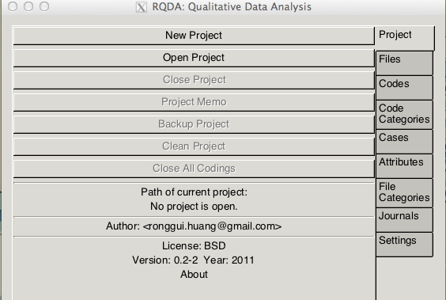

Qualitative Data Analysis with RQDA
====================================
Introduction
------------
This workshop covers the mechanics, rather than the methods, of performing a qualitative data analysis.  The examples will use the RQDA package running under RStudio.

Obtaining RQDA
--------------
RQDA is available on both PRI windows application servers: Kiev and Moscow. It is also available on the PRI linux network. Note that you must ssh into finland to run it as it does NOT run through the webserver version. 

If you want to load the software on your own machine, you will will not only be installing the RQDA package, but also GTK and RSQLite.   Information on the procedure can be found on the RQDA website [http://rqda.r-forge.r-project.org/](http://rqda.r-forge.r-project.org/).

Additionally, you will want to install the FireFox add-on: SQLite Manager.

Starting RQDA
---------------
Once your packages are loaded you will want to create a folder to store your text files.   (In RStudio, you can create an 'RStudio Project' in this folder.)  In addition to the text files, you can store any R programs and you will create an 'RDQA Project' coding database there too.

Now load the RQDA package by checking it in the Packages list in RStudio.  The first time you load the library, RQDA should start on its own, but if you close it during the session you can restart it again from the command line:


```r
RQDA()
```

The RQDA panel opens a separate window, but keep your normal RStudio console open as you will need both windows.



Projects
--------
For a new project, click on the "New Project" button and supply a name and associate the name to the folder on your system that you created above. This will create a file on your system with the extension '.rqda'.   Once the project has been created you can click the "Open Project" button.

You can click on the "Settings" button to set some defaults for your project.  This is especially useful if several people are working on the same project because you can identify the person coding.

You can include some project-level comments/documentation by clicking on the "Project Memo" button.

Files
-----
Files are the interviews for each Case in your study.  As of RQDA version 2.1 only plain text files are supported. Word documents or RTF files will need to be converted.  

If you change the original text file in any way, you will need to re-copy the modified file again.    

You have several options for inserting your text data into RQDA...

#### Import an existing plain text files
The content of your text files will be copied into a database when you import them into RQDA. To import a file into your project, click the "Files" button and then the "Import" button, then select the text file.

#### Bulk load 
If you want to import many files at once, you can use the `write.Files` command.  This is usually not an issue when you are coding individual transcripts, but it is a very useful feature when you want to extract open-ended questions from of a larger survey questionnaire for coding.  For example, I have a large survey of multiple choice questions, but question 64 is an open-ended question "What do you do with your friends when you are not in school?"  I can pull those responses into RQDA for coding.


```r
# Export the subject ID and open-ended question variables into a csv file
# from your SAS,Stata, SPSS, etc dataset load this into an R data frame
# named q64
q64 <- read.csv(file = "q64.csv")
str(q64)
```

```
## 'data.frame':	470 obs. of  2 variables:
##  $ ik_64_open: Factor w/ 437 levels "a lot, sometimes they pick on miranda",..: 152 131 145 320 29 352 228 207 51 306 ...
##  $ kidID     : int  9 10 11 14 15 17 22 23 24 25 ...
```

```r
head(q64)
```

```
##                                             ik_64_open kidID
## 1                            play basketball, watch tv     9
## 2   play around, hit each other, make each other laugh    10
## 3                    play basketball, play video games    11
## 4                                       talk, watch tv    14
## 5                                           don't know    15
## 6 try to get staff to let them ride bikes and watch tv    17
```

Create RQDA Case Files for each subject from the text of the question with the subject ID as the File name. 

```r
# Insert file and contents into db Startup RQDA
library(RQDA)
RDQA()
# Open the project from the command line rather than the GUI
openProject("~/Documents/RStuff/QDAtm/QDAtm/QDAtm/q64.rqda", updateGUI = TRUE)
# Pull the text of the question contained in the column 'ik_64_open' from
# the q64 data frame
q <- as.list(as.character(q64$ik_64_open))
# Assign the subject ID to the name of each File
names(q) <- q64$kidID
# Here are the first 3 lines
q[1:3]
# Use the write.FileList command to copy this info into the RQDA database
write.FileList(q)
# Close the Project from the command line
closeProject()
```


#### Use RQDA to enter your data
The last way to create Case Files is to enter your text data directly into RQDA.  Click on the "Files" button and then the "New" button.  Enter a name for your Case and a text editor window will open for you to enter data.  However, you **cannot** edit the data once you save it.  

Coding
------
Now that you have text in RQDA, you can begin coding.  
* Click "Files" button and double-click to select your file
* Click the "Codes" button and then "Add" to add new code names. Press "OK"
* Highlight the text in your File and select the Code name and then click the "Mark" button.
* You can double-click on any code name to see all text segments that have used that code.
* If you make a mistake, highlight the text and then click the "Unmark" button.

Cases
-----
If you have multiple interviews for one person in separate files, you can create a "Case" id to associate the files with a particular "Case" or unit of analysis.   

Coding Tips
-----------
* You can create a code name for 'questions' in your interview. This makes it easy to pull responses to a particular question from all cases
* You can Merge
* You can Rename

Code Categories
---------------

Attributes
----------
You can add attributes like gender, age group, school, etc to a File or a Case.  
DON'T KNOW HOW

File Categories
---------------
You may have different file categories, for example an interview may be conducted as a face-to-face or telephone interview.  You can associate a "File Category" to each file in order to pull files of a specific category. 

Memos
-----

Looking at the Database
-----------------------

Output
------
####Reports
####Plots

Extracting Data for Export
---------------------------

Backup
------

Resources
---------
[1] There is a terrific series of videos on using RQDA on YouTube  [http://www.youtube.com/playlist?list=PL66CB2FF65368715C] (http://www.youtube.com/playlist?list=PL66CB2FF65368715C).   I highly recommend them.  

[2] The official citation for the package follows:
HUANG, Ronggui. (2011). RQDA: R-based Qualitative Data Analysis. R
  package version 0.2-2. URL http://rqda.r-forge.r-project.org/.  Be sure to give the author credit in your publications. 


```r
# Create Corpus from a directory of text files
library(tm)
source <- DirSource("~/RStuff/qda_tm/QDAtm/QDAtm/responses/")  #input path for documents
YourCorpus <- Corpus(source, readerControl = list(reader = readPlain))  #load in documents
tdm <- TermDocumentMatrix(YourCorpus, control = list(removePunctuation = TRUE, 
    removeNumbers = TRUE, stopwords = TRUE, wordLengths = c(4, 100)))
plot(tdm, terms = findFreqTerms(tdm, lowfreq = 16)[1:25], corThreshold = 0.25)

```

