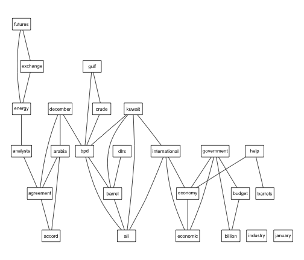

RQDA package for Qualitative Data Analysis
==========================================
I downloaded the package and installed it from within the standard R64 console.  It asked if I wanted to install Gtk2 and I said OK.  I am getting some errors about Gtk when I  launch RQDA in RStudio about not know my local directory or monitor, but things seem to work.

Text Mining with the tm package
========================================================
To use plotting in tm package I needed to install Rgraphviz from [bioconductor][http://www.bioconductor.org/packages/release/bioc/html/Rgraphviz.html]


```r
library("tm")
data("crude")
tdm <- TermDocumentMatrix(crude, control = list(removePunctuation = TRUE, removeNumbers = TRUE, 
    stopwords = TRUE))
```


You can also embed plots, for example:


```r
plot(tdm, terms = findFreqTerms(tdm, lowfreq = 6)[1:25], corThreshold = 0.5)
```

```
## Loading required package: Rgraphviz
```

```
## Loading required package: graph
```

```
## Loading required package: grid
```

 


